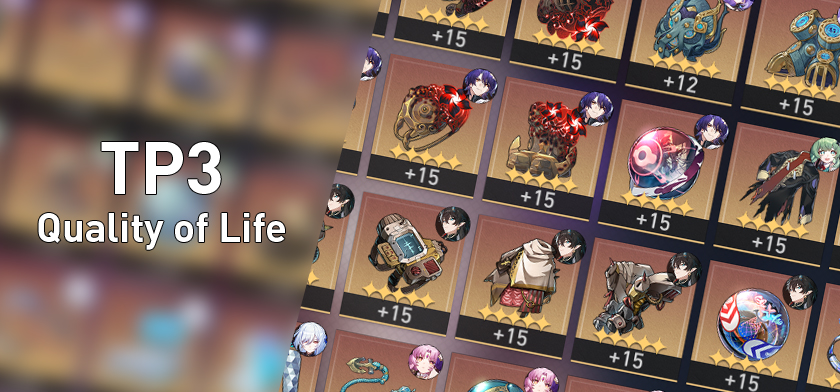

# AyED / AYP2 - TP3 1c2024

    

### Estudiante: SERRANTES OCHOA BRYAN - 110158

El proyecto se puede compilar manualmente por terminal con la siguiente línea:

> // g++ -I./include src/*.cpp main.cpp  -o main -std=c++23 -Wall -Werror -Wconversion //

O, alternativamente, con CMake, utilizando el archivo **CMakeLists.txt** presente en el directorio raíz.

Para distribuciones de Linux, se pueden utilizar los scripts presentes en el directorio raíz para compilar y ejecutar
la suite de tests. Requiere:

1. [g++](https://gcc.gnu.org/)
2. [CMake](https://cmake.org/)
3. [Valgrind](https://valgrind.org/)

Que se pueden instalar por terminal:

> sudo apt-get install // PROGRAMA //

# Aclaraciones adicionales:

// Al no tener un generador de artefactos, tomé el orden dado en el constructor y los números correspondientes para cada dato, entonces por esa razón al "generar" un artefacto lo que se ve son números y no el nombre que debería tener el tipo y rareza del artefacto.
Por ej: genero un artefacto,
                     18,Genio de las estrellas relucientes,2,5,4
y el constructor es del tipo artefacto(int id, std::string set, tipo tipo1, size_t nivel, rareza rareza1);
Donde dice 2 debería decir MANOS y donde dice 4 debería decir CUATRO_ESTRELLAS, esto es según como está enumerado la rareza y el tipo en artefacto.hpp//